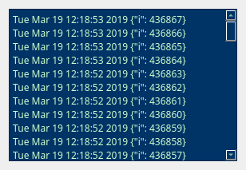

# Version 1 (basic)

The basic gui wiretap combines the QT event loop with the Asyncio event loop and
updates a plain text edit box each time a new message is received
on a given queue.

The NATS server, port and queuename is specified on the command line.

Using the utility it is trivial to initiate multiple gui wiretaps to 
monitor intermediate queues within a distributed pipeline.



To execute open 3 terminals: 

1. Docker NATS server
``` bash
# To run Docker NATS image
docker run -p 4222:4222 -p 8222:8222 -p 6222:6222 --name gnatsd -ti nats:latest
```

2. Generate some test messages (publishes to localhost:4222 p1.s0)
``` bash
python nats_test_publisher.py
```

3. Run the NATS/QT wiretap.
``` bash
python nats_qt_wiretap.py localhost 4222 p1.s0
```
